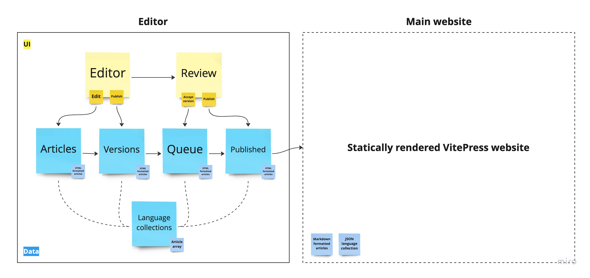

# Activist Handbook Edit (activisthandbook-edit)

Visual editor for Activist Handbook



## Install the dependencies

```bash
yarn
# or
npm install
```

### Start the app in development mode (hot-code reloading, error reporting, etc.)

```bash
export FIRESTORE_EMULATOR_HOST="localhost:8080"
export JAVA_HOME="/usr/lib/jvm/java-17-openjdk-amd64/"
quasar dev
```

### Lint the files

```bash
yarn lint
# or
npm run lint
```

### Format the files

```bash
yarn format
# or
npm run format
```

### Build the app for production

```bash
firebase login
quasar build
```

### Customize the configuration

See [Configuring quasar.config.js](https://v2.quasar.dev/quasar-cli-vite/quasar-config-js).
